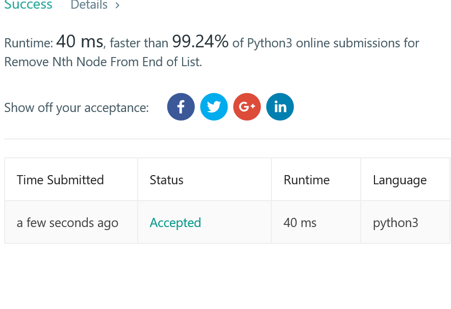

## leet code top popular problem number 9

the problem complain is below
```
Determine whether an integer is a palindrome. An integer is a palindrome when it reads the same backward as forward.

Example 1:

Input: 121
Output: true
Example 2:

Input: -121
Output: false
Explanation: From left to right, it reads -121. From right to left, it becomes 121-. Therefore it is not a palindrome.
Example 3:

Input: 10
Output: false
Explanation: Reads 01 from right to left. Therefore it is not a palindrome.
```

so basicall it is asked us to make some move about how to deal with this is kind easy,

but all of this is based on you making this problem by treating the interge as a str.

so you can compare this first index and the correctsponding last index,so its not that hard you know.

but if you really considering dealing this problem with some kind method like you are likely to start to work out a whole process like you dealing with the number, and check one position and one by one and some kindda work like.

it is clearly which doesnt help by making your move a lot easier,but otherwise, it can be really slow,cause there's alot extr computation you need to do.

but if you treating this as a string,all you need to do is to lookup in your memory which can save a lot time,so stop complaining and get up you ass and do it as the string way.

```
class Solution:
    def isPalindrome(self, x):
        """
        :type x: int
        :rtype: bool
        """
        x = str(x)
        if len(x) % 2==1:
            middle_position = len(x)//2
            for index in range(middle_position):
                if x[index] != x[len(x)-index-1]:
                    return False
            return True
        else:
            middle_position = len(x)//2
            for index in range(middle_position):
                if x[index] != x[len(x)-index-1]:
                    return False
            return True
        
```

the problem is that
```
Given a linked list, remove the n-th node from the end of list and return its head.
Example:
Given linked list: 1->2->3->4->5, and n = 2.

After removing the second node from the end, the linked list becomes 1->2->3->5.
Note:
Given n will always be valid.
Follow up:
Could you do this in one pass?
```

## prove of work

so this the problem of this week,this problem is all about the lisNode.which is an import data structure of our daily coding because it have some advantake in storage and its very fast to delete or add node in the middle of array.



and here is the code
```
# Definition for singly-linked list.
# class ListNode:
#     def __init__(self, x):
#         self.val = x
#         self.next = None

class Solution:
    def removeNthFromEnd(self, head, n):
        """
        :type head: ListNode
        :type n: int
        :rtype: ListNode
        """
        before_delete = head
        n_after_before_delete = head
        for x in range(n):
            n_after_before_delete = n_after_before_delete.next
        if n_after_before_delete ==None:
            return head.next
        while True:
            if n_after_before_delete.next== None:
                before_delete.next = before_delete.next.next
                return head
            before_delete=before_delete.next
            n_after_before_delete=n_after_before_delete.next
            
```


i have to say this result is probably the fastest code i ever done in leetcode. beat almost a hundred percent people who have done this problem.

and the key is that since this problem is kind of simple,so you have to make decision about the best time complexity.

and since its a linked list,and you will have check the all list to find the least n-th node.

so no matter what,the solution(if exists)should one traverse of the whole linked list.

so there is a direction to make the best algorithm now.


and here i present the somehow useful tool called cursor.which is used very offen in linkedlist problem.

the term cursor means that not like always you using one pointer point to the current node and one by one you can check if this node is what you want,then you can add node of remove the next node.

for the cursor it means it keeps two different pointer which keeps the constant distance between each other.

as for how can you make sure it always keeps the same distance is that in the initialize phrase,you set the two pointer at constant distance then you move the two pointer at the same time so you can keep the same distance at always.

for this problem,you will know that the bigest problem is that how can you fine the n-th least node during one traverse,and here we can use cursor to do that,once the later cursor comes to the end which is none,then it means the before cursor point to the right node then you can delete the afterwards node then.
