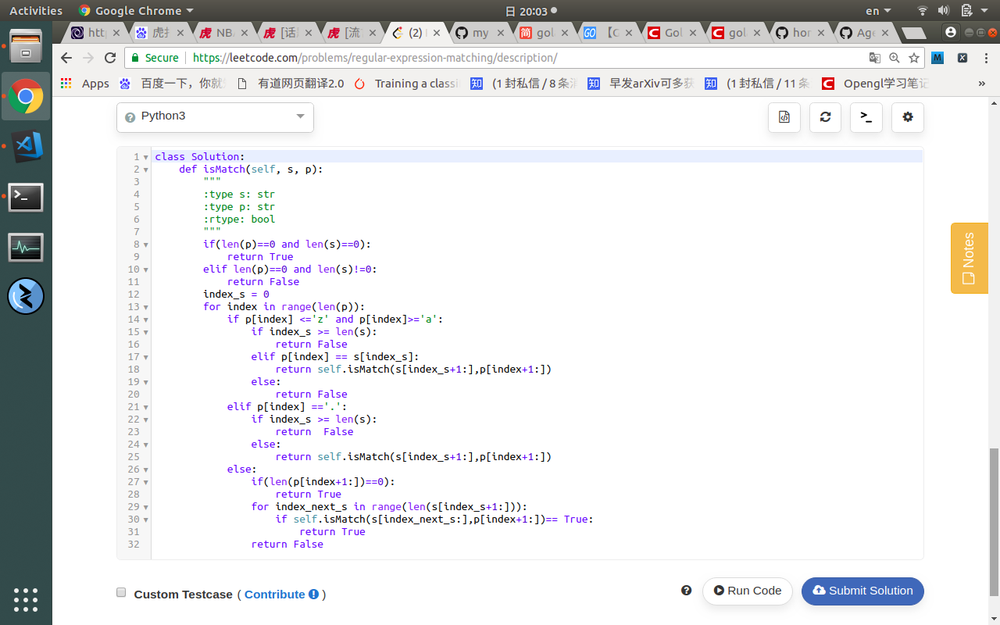

## leet code top popular problem number 10



## introduction
>first thing first,this problem some kindof refer to this kind of problem you have do it on recurse or you might code very lot and then get it done.

>so what kindof question is that
```
Given an input string (s) and a pattern (p), implement regular expression matching with support for '.' and '*'.

'.' Matches any single character.
'*' Matches zero or more of the preceding element.
The matching should cover the entire input string (not partial).

Note:

s could be empty and contains only lowercase letters a-z.
p could be empty and contains only lowercase letters a-z, and characters like . or *.
Example 1:

Input:
s = "aa"
p = "a"
Output: false
Explanation: "a" does not match the entire string "aa".
Example 2:

Input:
s = "aa"
p = "a*"
Output: true
Explanation: '*' means zero or more of the precedeng element, 'a'. Therefore, by repeating 'a' once, it becomes "aa".
Example 3:

Input:
s = "ab"
p = ".*"
Output: true
Explanation: ".*" means "zero or more (*) of any character (.)".
Example 4:

Input:
s = "aab"
p = "c*a*b"
Output: true
Explanation: c can be repeated 0 times, a can be repeated 1 time. Therefore it matches "aab".
Example 5:

Input:
s = "mississippi"
p = "mis*is*p*."
Output: false
```

## solution

> seems that it is a useful string matching problem which we use every day,some tool or algo like that can significant reduce our time at work.

> but thsi string match problem are not that easy at all,that's way back lot of trick and algo which reduce the compute complexity back to the old days.

> but this question actually doesnt do with that,all that need us to do is to using recurse method to solve match problem


> so i firstly cut up all the string,and then get the sub string,then i have to deal with all the mark matching problem instead of all the quetion at many times.

> the solution is below
```
class Solution:
    def isMatch(self, s, p):
        """
        :type s: str
        :type p: str
        :rtype: bool
        """
        if(len(p)==0 and len(s)==0):
            return True
        elif len(p)==0 and len(s)!=0:
            return False
        index_s = 0
        for index in range(len(p)):
            if p[index] <='z' and p[index]>='a':
                if index_s >= len(s):
                    return False
                elif p[index] == s[index_s]:
                    return self.isMatch(s[index_s+1:],p[index+1:])
                else:
                    return False
            elif p[index] =='.':
                if index_s >= len(s):
                    return  False
                else:
                    return self.isMatch(s[index_s+1:],p[index+1:])
            else:
                if(len(p[index+1:])==0):
                    return True
                for index_next_s in range(len(s[index_s+1:])):
                    if self.isMatch(s[index_next_s:],p[index+1:])== True:
                        return True
                return False
```
