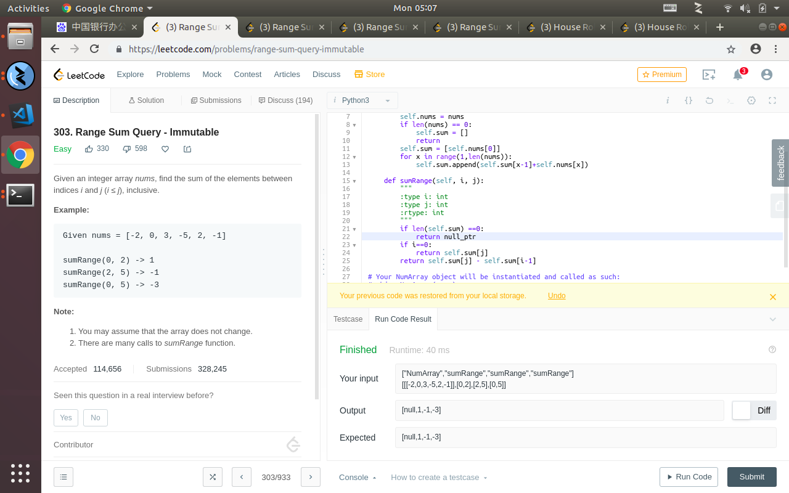

## dynamic programing problem on leetcode



## intro of the question

the problem is that
```
303. Range Sum Query - Immutable
Easy
330
598


Given an integer array nums, find the sum of the elements between indices i and j (i ≤ j), inclusive.

Example:
Given nums = [-2, 0, 3, -5, 2, -1]

sumRange(0, 2) -> 1
sumRange(2, 5) -> -1
sumRange(0, 5) -> -3
Note:
You may assume that the array does not change.
There are many calls to sumRange function.

```
i know this question is not much like a acm problem or some coding contest like that.but a very realistic problem that how should implement a array that can support a function that can return the sum of the subsequence.

so a lot of people dislike this problem mainly because that the problem outlike doesnt says that the test case will be a lot of works on suming.

so it actually can be more specific about what they want a little bit more.


so after all,the solution should be when you init the class,you should forming a dict which can return the suming very fast.
which can much reduce the after all computation time.

the solution is below
```


from functools import reduce
class NumArray:
    def __init__(self, nums):
        """
        :type nums: List[int]
        """
        self.nums = nums
        if len(nums) == 0:
            self.sum = []
            return 
        self.sum = [self.nums[0]]
        for x in range(1,len(nums)):
            self.sum.append(self.sum[x-1]+self.nums[x])

    def sumRange(self, i, j):
        """
        :type i: int
        :type j: int
        :rtype: int
        """
        if len(self.sum) ==0:
            return null_ptr
        if i==0:
            return self.sum[j]
        return self.sum[j] - self.sum[i-1]

```


all in all,this is a dynamic programing problem,cause that the origin purpose of the algo is to caculate the needed step always for once to speed up.