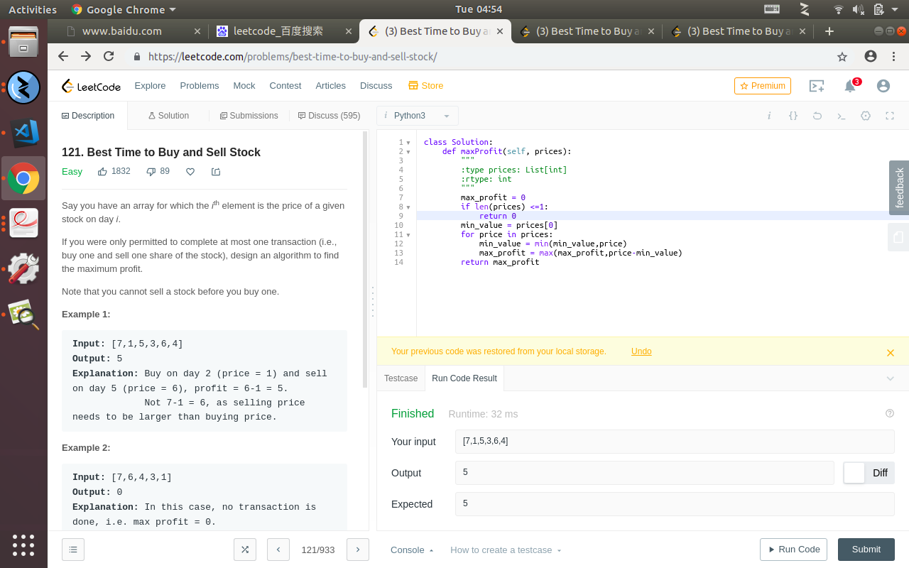

## dynamic programing problem on leetcode



## intro of the question

the problem is that
```
121. Best Time to Buy and Sell Stock
Easy
1832
89


Say you have an array for which the ith element is the price of a given stock on day i.

If you were only permitted to complete at most one transaction (i.e., buy one and sell one share of the stock), design an algorithm to find the maximum profit.

Note that you cannot sell a stock before you buy one.

Example 1:

Input: [7,1,5,3,6,4]
Output: 5
Explanation: Buy on day 2 (price = 1) and sell on day 5 (price = 6), profit = 6-1 = 5.
             Not 7-1 = 6, as selling price needs to be larger than buying price.
Example 2:

Input: [7,6,4,3,1]
Output: 0
Explanation: In this case, no transaction is done, i.e. max profit = 0.

```


all in all,let's be frankly,in the first sight,i dont think this is a problem about dynamic programing,just pretend that as a naive cove all the possibility like problem so i wrote a O(n^2) solution for that,and it seems it goes very well,but stuck in the last case.

which obivously shows that the solution must be under the O(n^2) complicity like O(nlongn) or even O(n).

so yeah,still not thinking it as a dynamic programing prorblem.and i check for the answear,suddenly it shows that you must holding a temp variable for min or max during all the iterations.

which is not likely a dynamic programing problem still.but indeed,it can cut up a lot of complicity which is the purpose of dynamic programing.


the solution is below
```


class Solution:
    def maxProfit(self, prices):
        """
        :type prices: List[int]
        :rtype: int
        """
        max_profit = 0
        if len(prices) <=1:
            return 0
        min_value = prices[0]
        for price in prices:
            min_value = min(min_value,price)
            max_profit = max(max_profit,price-min_value)
        return max_profit

```


all in all,this is a dynamic programing problem,cause that the origin purpose of the algo is to caculate the needed step always for once to speed up.