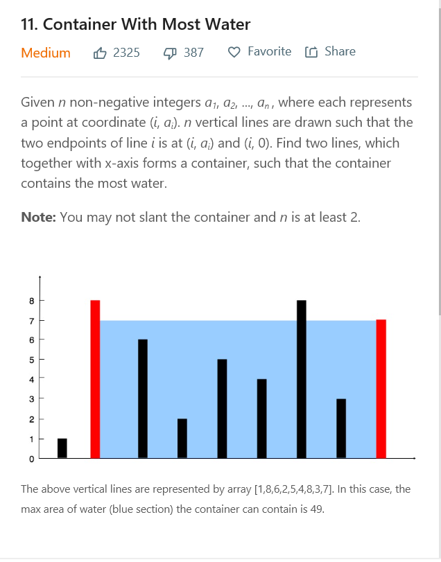

## most popular problems on leetcode



## intro of the question
the problem is that
```
Given n non-negative integers a1, a2, ..., an , where each represents a point at coordinate (i, ai). n vertical lines are drawn such that the two endpoints of line i is at (i, ai) and (i, 0). Find two lines, which together with x-axis forms a container, such that the container contains the most water.
Note: You may not slant the container and n is at least 2.

```

so let get to work. firstly by the first glance,you can know this is just another problem you can solve with brutal force real quick.


and second thought you will know brutal force actually . the reason is that the complexity is O(n^2) which is totaly acceptable.


```
class Solution:
    def maxArea(self, height):
        """
        :type height: List[int]
        :rtype: int
        """
        _max = 0
        for x in range(len(height)):
            for y in range(x,len(height)):
                if min(height[x],height[y])*(y-x) > _max:
                    _max = min(height[x],height[y])*(y-x)
        return _max
```

which is pretty easy i will say.

but there will still be better solution indeed.

like you can search from out to inside.which can be a huge save of time.cause you know there exists a trade off between the x-index distance and y-minimun height which forms the exactly value of surface.

so if you know there is no much higher height in the insider you can just stop.