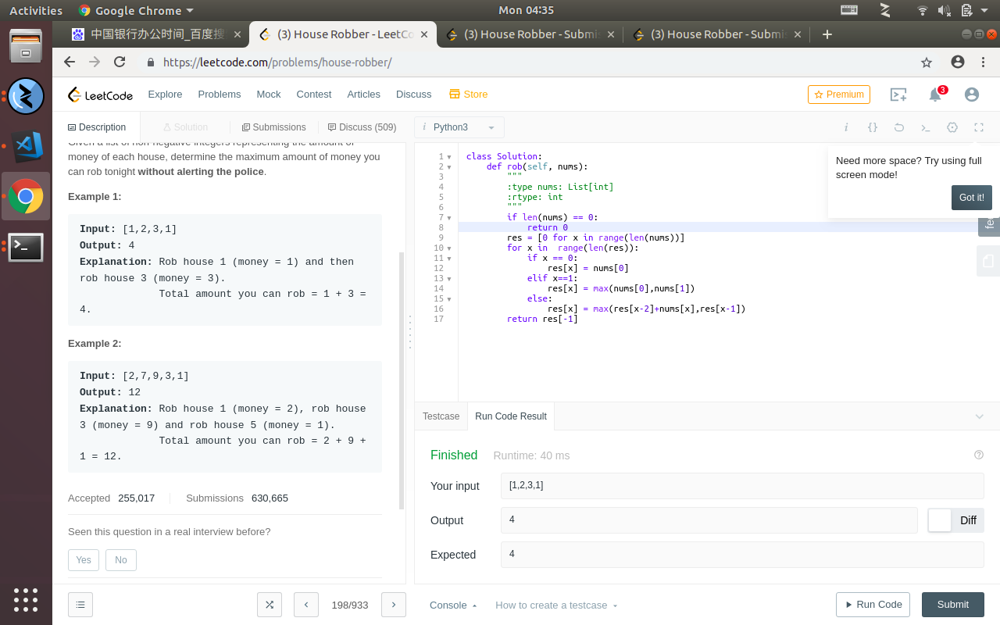

## dynamic programing problem on leetcode



## intro of the question

the problem is that
```
198. House Robber
Easy
1736
58


You are a professional robber planning to rob houses along a street. Each house has a certain amount of money stashed, the only constraint stopping you from robbing each of them is that adjacent houses have security system connected and it will automatically contact the police if two adjacent houses were broken into on the same night.

Given a list of non-negative integers representing the amount of money of each house, determine the maximum amount of money you can rob tonight without alerting the police.

```
i guess a lot of people first knowing the terms dynamic programing,some will think that is this have something to do with dynamic generates code?

but you might be wrong,cause  this is the technica that you can reduce compute complicate problem like O(n!) into O(n^2).

but you know,these question must have some limits or you might just discover the overall solution for n=np problem.

so what is the limits anyway.the basic idea that you can put you dynamic programing method is that you can put the problem in to the function which transform each position.

just like this question,you might notice that if we look the decision of whether rob the house or not only depends on the before two houses you rob or not.

so the only helpful reason you might use is that if you rob this house than it might affects the afterwards decision.


but that isnt you problem now.now all you need to consider is that you should or should not rob this house depends on whether rob this will make you richer or not(cause you already rob the last houes).

so the solution is 
```
class Solution:
    def rob(self, nums):
        """
        :type nums: List[int]
        :rtype: int
        """
        if len(nums) == 0:
            return 0
        res = [0 for x in range(len(nums))]
        for x in  range(len(res)):
            if x == 0:
                res[x] = nums[0]
            elif x==1:
                res[x] = max(nums[0],nums[1])
            else:
                res[x] = max(res[x-2]+nums[x],res[x-1])
        return res[-1]
```