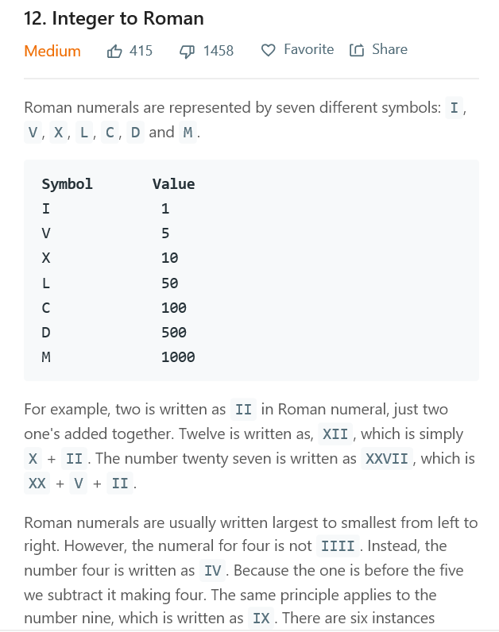

## most popular problems on leetcode



## intro of the question
the problem is that
```
Roman numerals are represented by seven different symbols: I, V, X, L, C, D and M.
Symbol       Value
I             1
V             5
X             10
L             50
C             100
D             500
M             1000
For example, two is written as II in Roman numeral, just two one's added together. Twelve is written as, XII, which is simply X + II. The number twenty seven is written as XXVII, which is XX + V + II.
Roman numerals are usually written largest to smallest from left to right. However, the numeral for four is not IIII. Instead, the number four is written as IV. Because the one is before the five we subtract it making four. The same principle applies to the number nine, which is written as IX. There are six 

```

## prove of work
so you will know that this is a kind of easy one .cause back to our normal daily life,we acutually apply some algorithm like that just to symbolify the result.

and for this one,all you have to do is to say using the % process to make each one of the different stage of process make it produce each symbol from top to down.

and of course there is some more rules you need to take care of like 4 doesnt just represent as the four vertical line but the line vertical line with a v.

some by making this specific rule and the formal divide process,you can get the right result eventually.

the answear is that
```
class Solution(object):
    def intToRoman(self, num):
        """
        :type num: int
        :rtype: str
        """
        RomanList = [['I', 'V', 'X'], ['X', 'L', 'C'], ['C', 'D', 'M'], ['M', 'None']]
        bit = 3
        outStr = ''
        while num:
            tem = num // (10**bit)
            if tem % 5 == 4:
                outStr = outStr + RomanList[bit][0] + RomanList[bit][tem // 5 + 1]
            else:
                outStr = outStr + RomanList[bit][1]*(tem // 5) + RomanList[bit][0]*(tem % 5)
            num %= (10**bit)
            bit -= 1
        return outStr
        
```
from the code you can see its just a simple one problem.
just a few lines you can get the right result which also a well represent of our daily thinking,for its a normal problem,so the algorithm must be some kind of simple to remember and use.