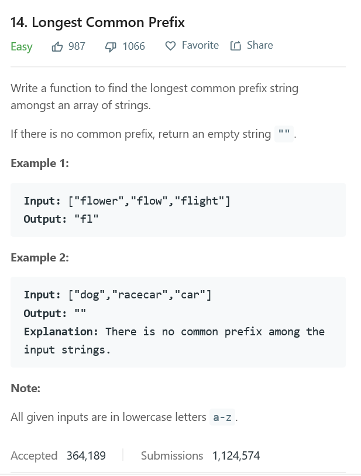
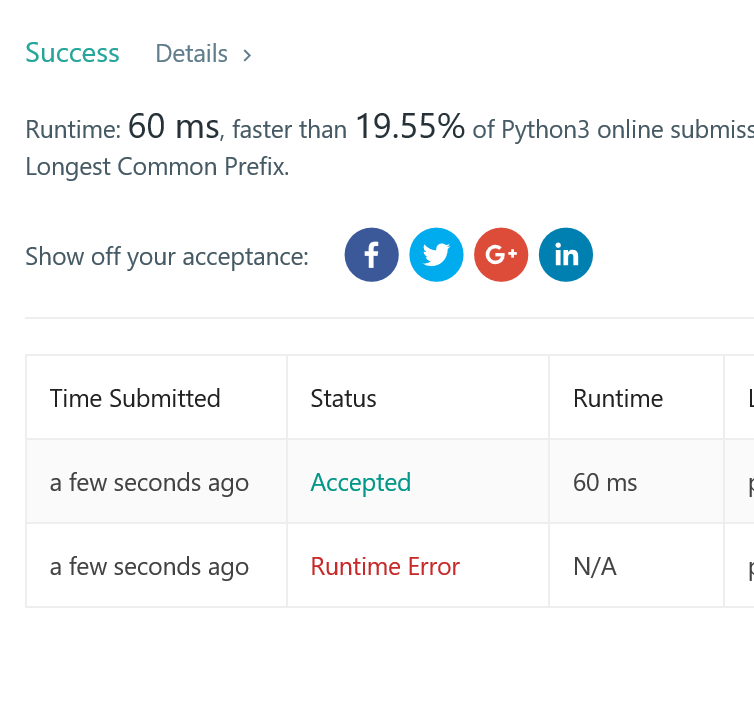

## most popular problems on leetcode



## intro of the question
the problem is that
```
Write a function to find the longest common prefix string amongst an array of strings.
If there is no common prefix, return an empty string "".
```

## prove of work

so enough talking and get to the answear,this problem just want you to find the most longest prefix,which is a little bit too easy.



and here is the code
```
class Solution:
    def longestCommonPrefix(self, strs):
        """
        :type strs: List[str]
        :rtype: str
        """
        if len(strs)==0:
            return ""
        minimun_length = min(list(map(lambda x:len(x),strs)))
        for x in range(minimun_length):
            _char = strs[0][x]
            for _str in strs:
                if _char != _str[x]:
                    return strs[0][:x]
        return strs[0][:minimun_length]
```


so basically the whole priciple of this algo is to say that we want go a second level loop.and one loop to range from the least small string head to tall.

and the second level loop is to say since we can get the right character and we will make sure each of the str all satisfy the prefix.

once it doesnt satisfy the prefix,then the algorithm can termial.
and return the length of the existing prefix length.